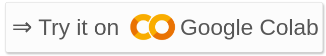
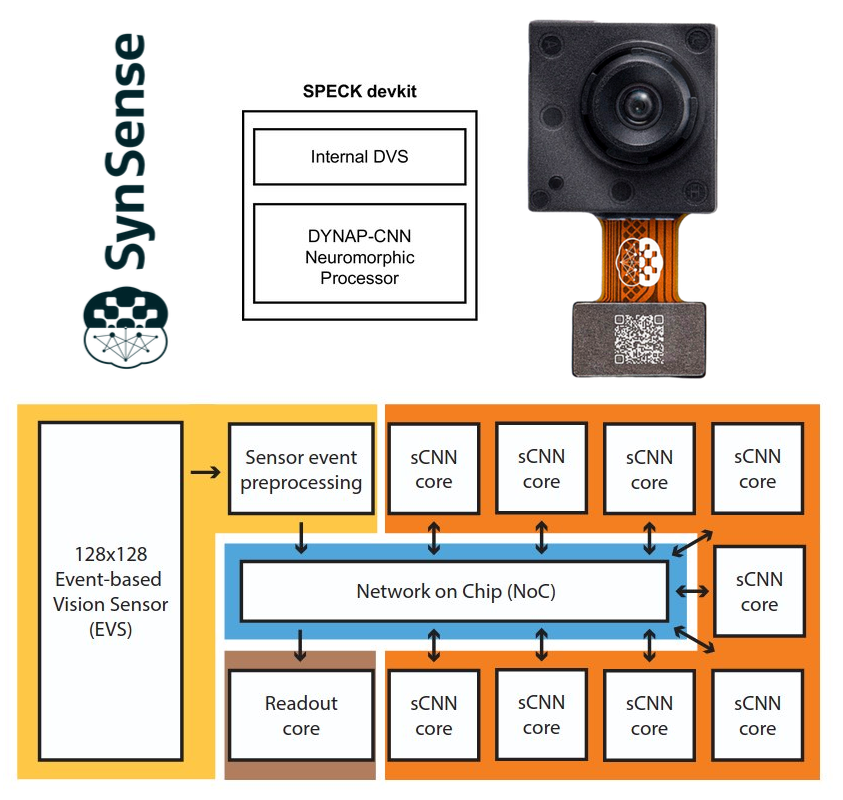
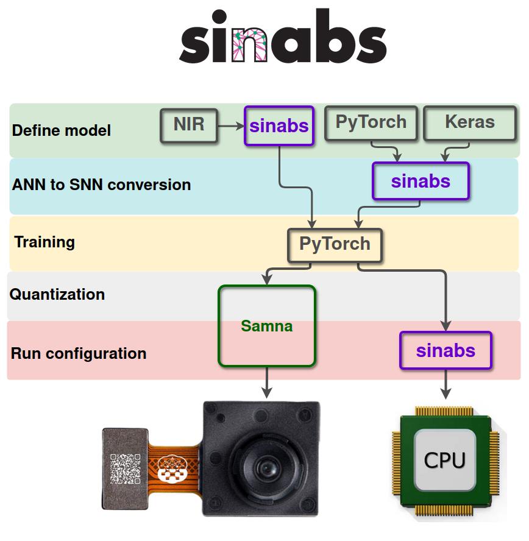
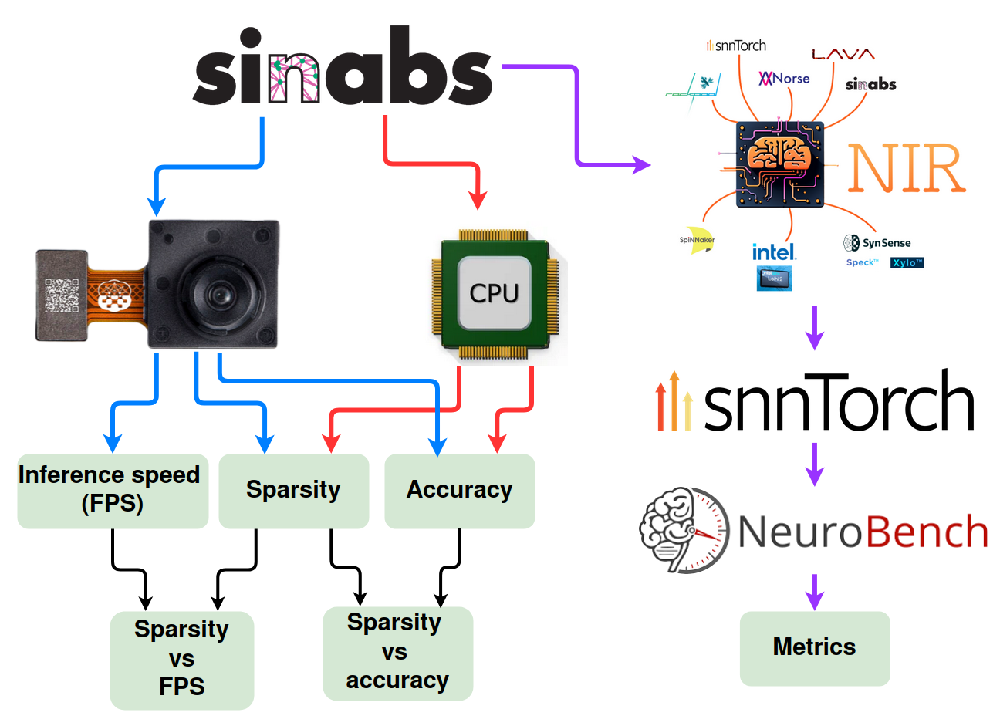

# inNuCE Lab hands-on for BRANDY 2025: Working with SPECK, an example

In this hands-on session we will follow two notebooks. For both of them you can find links to google colab or ebrains colab. If you want to execute the training cells, we advise to use google colab as it has support for GPUs, which decreases significantly the training times.

## Notebook 1: Training and testing models with sinabs

## Notebook 2: Using NIR to translate model to SNNTorch, and use NeuroBench

# SPECK

We will be using the SPECK devkit by SynSense which integrates a DVS camera and the DYNAP-CNN Neuromorphic processor:

From https://www.synsense.ai/products/speck-2/:

> Speck™ is a fully event-driven neuromorphic vision SoC. Speck™ is able to support large-scale spiking convolutional neural network (sCNN) with a fully asynchronous chip architecture. Speck™ is fully configurable with the spiking neuron capacity of 320K. Furthermore, it integrates the state-of-art dynamic vision sensor (DVS) that enables fully event-driven based, real-time, highly integrated solution for varies dynamic visual scene. For classical applications, Speck™ can provide intelligence upon the scene at only mWs with a response latency in few ms.

# Typical development workflow for SPECK

The typical development workflow for SPECK is done using **sinabs**:

From https://sinabs.readthedocs.io/v3.0.3/

> Sinabs Is Not A Brain Simulator, It’s a deep learning library based on PyTorch for spiking neural networks, with a focus on simplicity, fast training and extendability. Sinabs works well for Vision models because of its support for weight transfer. If you’re

# The hands-on workflow

The development workflow we will follow is:

## Notebook 1:
 - We will use **sinabs** to define and train our network
 - The network will be run using the sinabs "simulator" to obtain **sparsity** and **accuracy** metrics
 - The network will be deployed to **speck**, to obtain the **inference speed** as well. **NOTE:** For this step you need the hardware chip and you need to run the notebooks locally instead of on colab. If you want to try this out you can ask to the presenters for more information.
 - We will then do some basic analysis of how sparsity affects accuracy and speed.
 - Finally, we export the model to **NIR**.

## Notebook 2:
 - From NIR, we will export the model to **snnTorch**
 - With the snnTorch model, we can make use of **NeuroBench** to obtain metrics related to the execution of the model.
